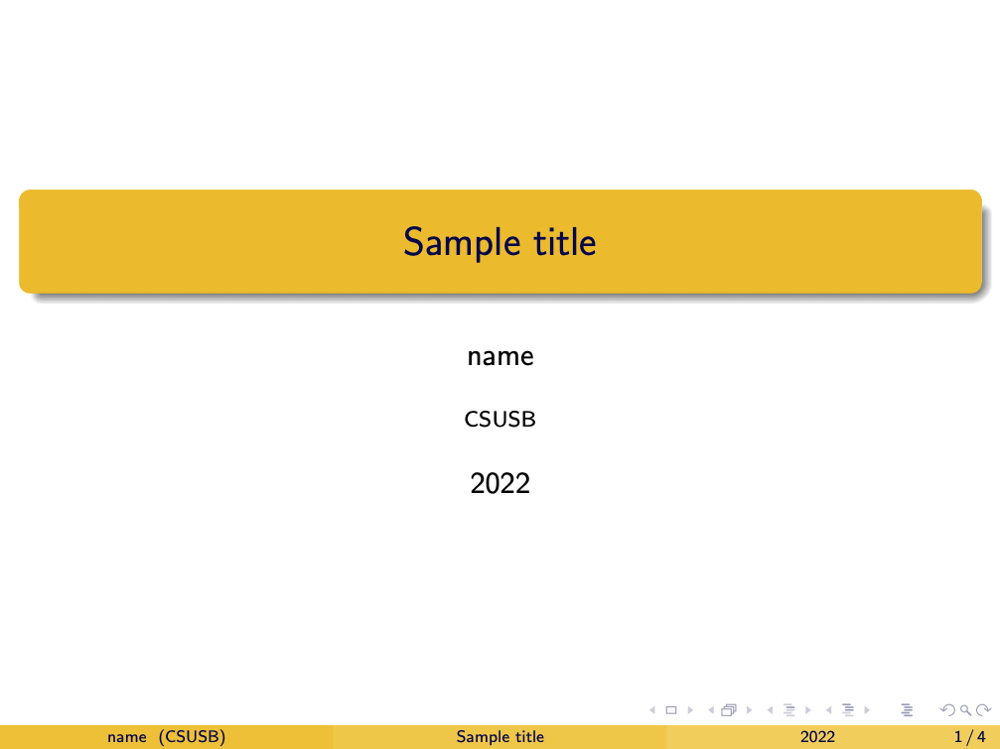
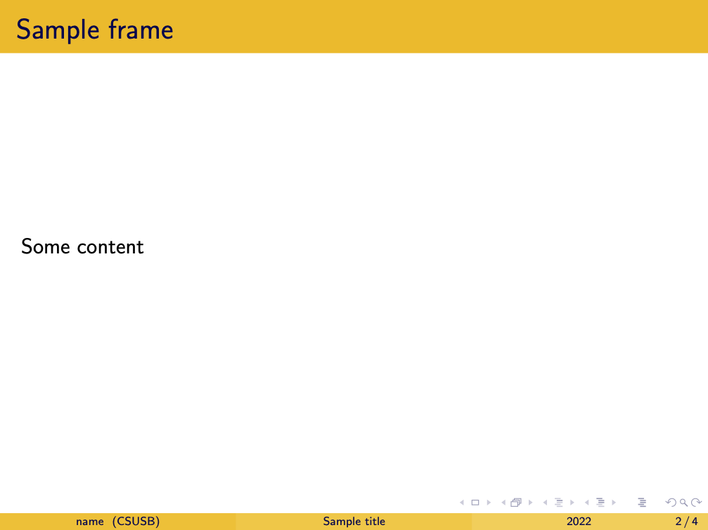
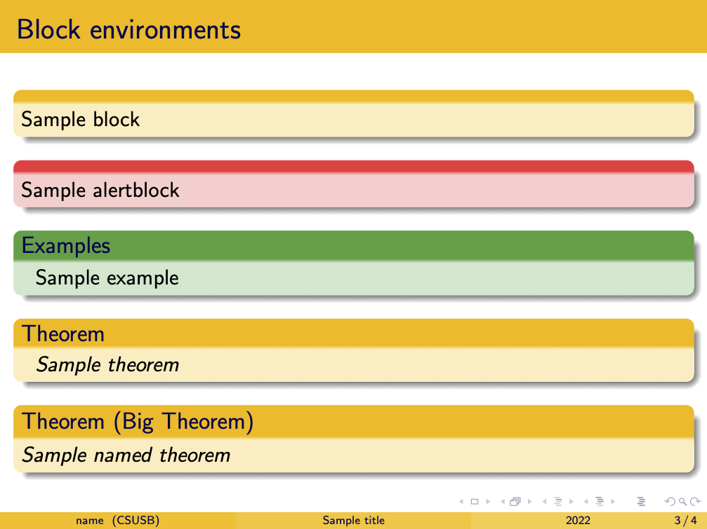
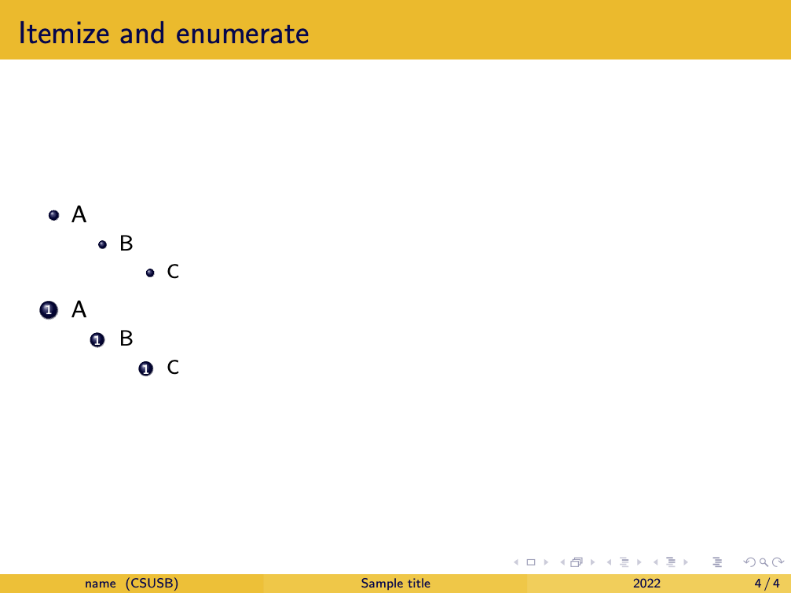

===============
Oct 31th, 2022
===============

.. Prep for the course
.. ~~~~~~~~~~~~~~~~~~~

Do to 
------

* Go over the schedule 
* Go over the grading scheme
* Brief introduction to the beamer class, https://www.overleaf.com/learn/latex/Beamer
  
  - More thorough treatments starts here, https://www.overleaf.com/learn/latex/Beamer_Presentations%3A_A_Tutorial_for_Beginners_(Part_1)%E2%80%94Getting_Started

.. .. note:: 

..     I apologize for the missing images below. Please use https://www.overleaf.com/read/pnjfsjgwjnyv for the reference of images. 

Brief introduction to Beamer class
-----------------------------------

The LaTeX Beamer class creates presentation-style documents such as Microsoft PowerPoint or Google Slide. 
In the most commonly used LaTeX classes, such as ``article`` or ``amsart`` (this is what we use in class), LaTeX handles page separation. 
In the Beamer class, this is done by ``\begin{frame}`` and ``\end{frame}``. 

That is to have the following outcome

we need to put the content in the ``frame`` environment. 

.. note:: 

    In these notes, we used the theme ``Madrid`` with themecolor ``crane``. 

Preamble and title page
~~~~~~~~~~~~~~~~~~~~~~~~~~~~~~~~~~~

Here is the minimal required code to use the Beamer class and to have the title page. 

.. code-block:: latex
    :caption: LaTeX Beamer MRE

    \documentclass{beamer}
    \usetheme{Madrid}       % Use the one you like
    \usecolortheme{crane}   % Use the one you like

    \title{Sample title}
    \author{name}
    \institute{CSUSB}
    \date{2022}

    \begin{document}

    \frame{\titlepage} %This creates the first page

    \end{document}

They are self-explantory. For a more advanced setting of the title page, refer to `the title page` on [here](https://www.overleaf.com/learn/latex/Beamer).

Block environments
~~~~~~~~~~~~~~~~~~~

The Beamer class is equipped with several predefined commands and environments. 
It is worth remembering that we do not need to define the theorem environment. 
Here is a list of predefined commands.

* block
* alertblock
* example
* theorem

To have a named environment, replace ``{~}`` with desired names. 

.. code-block:: latex

    \begin{block}{~} 
    Sample block
    \end{block}

    \begin{alertblock}{~}
    Sample alertblock
    \end{alertblock}

    \begin{examples}{~}
    Sample example
    \end{examples}

    \begin{theorem}{~}
    Sample theorem
    \end{theorem}

    \begin{theorem}[{Big Theorem}]
    Sample named theorem
    \end{theorem}
    \end{frame}

Itemize and enumerate
~~~~~~~~~~~~~~~~~~~~~~~~

Lastly, Beamer comes with predefined symbols for the itemize and enumerate environments. 

.. note:: 

    To override a symbol for an item, we can use ``\item [My symbol]``. For more about override, the symbols refer to 

    * https://tex.stackexchange.com/questions/545629/change-itemize-symbol-in-beamer#:~:text=If%20you%20want%20to%20locally,%5B%5Ctextbullet%5D%20...%20.&text=and%20with%20one%20of%20the,different%20symbol%20of%20your%20choice;
    * https://tex.stackexchange.com/questions/93874/where-can-i-find-a-list-of-itemize-bullet-shapes-in-latex-beamer

Here is a sample code and outcome. 

.. code-block:: latex

    \documentclass{beamer}

    \begin{document}

    \begin{frame}{Itemize and enumerate}

    \begin{itemize}
      \item A
          \begin{itemize}
              \item B
              \begin{itemize}
                  \item C
              \end{itemize}
          \end{itemize}    
    \end{itemize}

    \begin{enumerate}
      \item A
          \begin{enumerate}
              \item B
              \begin{enumerate}
                  \item C
              \end{enumerate}
          \end{enumerate}    
    \end{enumerate}

    \end{document}

  

